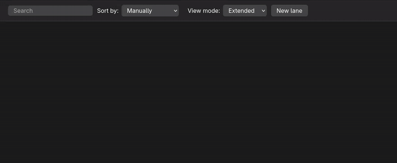

#  Tasks.md
A self-hosted, Markdown file based task management board.




## ⭐ Features
- Create cards, lanes and tags in a modern and responsive interface;
- Write cards as Markdown files;
- Easy to install with a single Docker image;
- Light and dark themes synced with operating system settings;
- Heavily customizable with 3 default color themes ([Adwaita](https://gnome.pages.gitlab.gnome.org/libadwaita/doc/main/named-colors.html), [Nord](https://www.nordtheme.com/) and [Catppuccin](https://github.com/catppuccin/catppuccin));
- Support for subpath based reverse-proxy with an environment variable for base path;
- Can be installed as PWA.

## Upgrade from 2.X.X to 3.X.X
If you were running a docker container with version 2 of Tasks.md and want to upgrade it to version 3, please follow up [those instructions](/public/migration-guide.md) as it requires some tweeks for it to work properly.

## 🐋 Installation
### Docker
Paste this command:
```
docker run -d \
  --name tasks.md \
  -e PUID=1000 \
  -e PGID=1000 \
  -e TITLE="" \
  -e BASE_PATH="" \
  -e LOCAL_IMAGES_CLEANUP_INTERVAL=1440 \
  -p 8080:8080 \
  -v /path/to/tasks/:/tasks/ \
  -v /path/to/config/:/config/ \
  --restart unless-stopped \
  baldissaramatheus/tasks.md
```
Remove the environment variables you don't want to keep (all of them are optional, PUID and PGID are recommended), replace `/path/to/something` with directories that exist in your filesystem and then execute it. The environment variables are the following:
- `PUID` and `PGID`: User ID and group ID that owns the files and directories. On linux distros you can find your user's UID and GID running `id` in the terminal, but it's usually `1000` for both variables. If no value is assigned for those variables, docker will create all the files and directories as root. You can read more about it [here](https://docs.linuxserver.io/general/understanding-puid-and-pgid/).
- `TITLE`: A given name that shows below the header and in the browser tab when accessing root path;
- `BASE_PATH`: Base path in the url. Use this variable if you are going to run the app under a subpath based reverse-proxy. Be aware that PWA does not work when BASE_PATH is set with anything other than "/";
- `LOCAL_IMAGES_CLEANUP_INTERVAL`: After a given interval the app will remove all local images that aren't present in any task. This variable control the duration in minutes of this interval. The default value is 1440 (exactly 24h). Set it as 0 to disable it.


### docker-compose
```
version: "3"
services:
  tasks.md:
    image: baldissaramatheus/tasks.md
    container_name: tasks.md
    environment:
      - PUID=1000
      - PGID=1000
    volumes:
      - /path/to/tasks:/tasks
      - /path/to/config:/config
    restart: unless-stopped
    ports:
      - 8080:8080
```
Use the Docker section above as reference for setting up variables and volumes.


### Source code
Clone the repository with `git clone --recursive`, open a terminal instance in the `/frontend` directory and another one in the `/backend` directory, then in both of them run `npm install` and `npm start`. The env variables are set in `package.json` file for both directories, and are the same ones listed in the Docker section above, plus `CONFIG_DIR` and `TASKS_DIR` for config and tasks directories paths.

## 🎨 Customize
You can customize the application CSS through the `custom.css` (within `/config` directory if you're on Docker). You can replace the default `adwaita` theme with `nord` or `catppuccin`, or you can make your own changes. The easieste way to customize the application is to use the existing color variables (detailed [below](#color-variables)), but if you want to make changes other than color replacements you can use [index.css](frontend/src/stylesheets/index.css) file as a reference.

### Color variables
- `color-accent`: Highlight color;
- `color-foreground`: Anything that goes against background that needs contrast, text color;
- `color-background-1`: Main background color, used as background color for the app main page;
- `color-background-2`: 1 layer above main background color, used as background color for editor code-block, dialog, popovers, lanes and header;
- `color-background-3`: 2 layer above main background color, used as background color for cards;
- `color-background-4`: 3 layer above main background color, used as background color for buttons and inputs;
- `color-alt-1`: Used as tag color, input error and past due date;
- `color-alt-2`: Used as tag color;
- `color-alt-3`: Used as tag color and due date when it's current date;
- `color-alt-4`: Used as tag color;
- `color-alt-5`: Used as tag color;
- `color-alt-6`: Used as tag color;
- `color-alt-7`: Used as tag color;


## 📁 Files structure
The way directories and files are organized in Tasks.md is quite simple. Every lane you add within the app is a directory in your filesystem and every task is file.

#### So if your tasks look like this:


#### Your files should look like this:


Sub-directories can also be opened as their own projects. In this example, by opening the app under `/backlog` path it will treat this directory as a different project, with its own lanes and tasks.

More details (and it how it looks within Obsidian) can be found [here](https://github.com/BaldissaraMatheus/Tasks.md/issues/49).

## 💻 Technology stack
With the goal of having a good mix of performance and maintainability, the application was built with [SolidJS](https://github.com/solidjs/solid) and [Koa](https://github.com/koajs/koa). It also uses [Stacks-Editor](https://github.com/StackExchange/Stacks-Editor) for text editing and [serve-static](https://github.com/expressjs/serve-static) to serve the css files as-is.

## 🔨 Contribute
### Bugfixes and new features requests
Feel free to create issues for encountered bugs or to request new features. Also give a thumbs up to the issues you feel that are relevant to be implemented for next releases.

### Development
If you want to contribute to its development, select one of the [existing issues](https://github.com/BaldissaraMatheus/Tasks.md/issues), develop your solution and submit a pull request, it will eventually be reviewed and may be merged with the existing code. If you're not confident about your solution, discuss your ideas in its issue page or publish a draft pull request.

### Sponsor
If you like the project, consider [becoming a sponsor](https://github.com/sponsors/BaldissaraMatheus) with a one-time donation!

